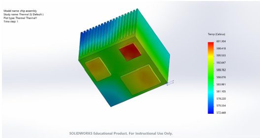
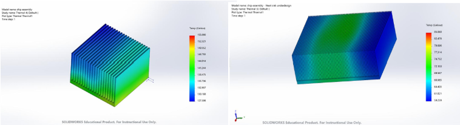
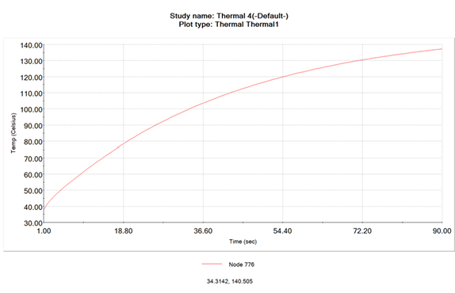

# Thermal Management Optimization: Parametric & Transient Heat Sink Modeling

## 📌 Executive Summary
As modern microelectronics increase processing power, effective thermal management is essential to mitigate performance degradation and hardware failure. This project details the design, thermal simulation, and geometric optimization of a high-performance pure copper heat sink developed to regulate temperatures across three independent integrated circuit (IC) chips generating 100W, 80W, and 60W of heat. 

By executing multi-scenario steady-state convection modeling and transient time-series solvers, the heat sink geometry was iteratively optimized to maintain safe, uniform chip temperatures under variable boundary conditions.

---

## 📐 Material & Assembly Specifications
The system consists of three silicon heat-generating chips mounted beneath a unified thermal dissipation architecture.

* **IC Chips:** Silicon substrate with a baseline thermal conductivity of 0.2 W/(m·K).
* **Heat Sink Material:** Pure Copper selected for its high thermal conductivity of 390 W/(m·K), facilitating rapid, passive conductive heat transfer away from the source interfaces.
* **Boundary Condition:** The bottom assembly face is completely insulated ($q = 0$) to simulate zero heat loss through the mounting chassis, forcing all thermal energy upward through the fins.

  

  <em>Figure 1: 3D CAD assembly modeling the pure copper heat sink mounted over three high-load IC chips.</em>

---

## 💻 Steady-State Convection Case Studies
The assembly's cooling efficiency was evaluated under three distinct environmental convection coefficients ($h$) simulating different operational cooling environments:

1. **Case 1 (Low Convection / Natural Ambient):** $h = 10\text{ W/(m²·K)}$ | Resulted in extreme chip temperatures (over 601.3°C), indicating a critical need for forced air or geometry intervention.
2. **Case 2 (Medium Convection / Moderate Airflow):** $h = 50\text{ W/(m²·K)}$ | Significantly reduced peak temperatures, showing stable, localized thermal gradients.
3. **Case 3 (High Convection / Strong Forced Cooling):** $h = 100\text{ W/(m²·K)}$ | Provided maximum heat rejection, optimizing chip life expectancy.

---

## 📈 Geometric & Parametric Design Iterations
To balance material weight with manufacturing constraints, the fin profiles were parametrically varied to evaluate *Under-Designed*, *Acceptable*, and *Over-Designed* thresholds. Fin height, spacing density, and cross-sectional thicknesses were modified to maximize total surface area contact without inducing air stagnation regions.

  

  <em>Figure 2: Side-by-side FEA comparison mapping out the geometric evolution from an under-designed base configuration to an optimal operational design.</em>

---

## ⏱️ Transient Thermal Solver Validation
Beyond static steady-state analysis, a **90-second transient thermal simulation** was executed to track the real-time thermal-soak progression of the copper block from cold startup to operating saturation. At $t = 1\text{s}$, steep localized gradients form at the chip boundaries; by $t = 19\text{s}$, the copper conducts the energy uniformly across the fins; and toward $t = 90\text{s}$, the system gracefully plateaus toward its thermal equilibrium.

  

  <em>Figure 3: Transient temperature tracking curve on IC 2 over a 90-second heating phase before reaching thermal steady-state.</em>

---

## 📂 Project Assets & Reference Documents
The complete engineering document detailing node-by-node temperature mapping, localized element calculations, and full solver constraints can be accessed below:

📄 **[Read the Full Technical Thermal Analysis Report (PDF)](documents/Heat_Sink_Thermal_Analysis_Report.pdf)**
